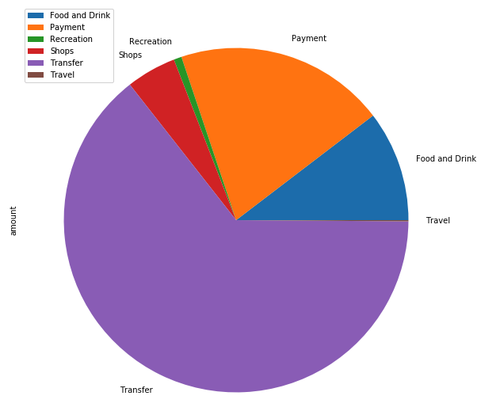
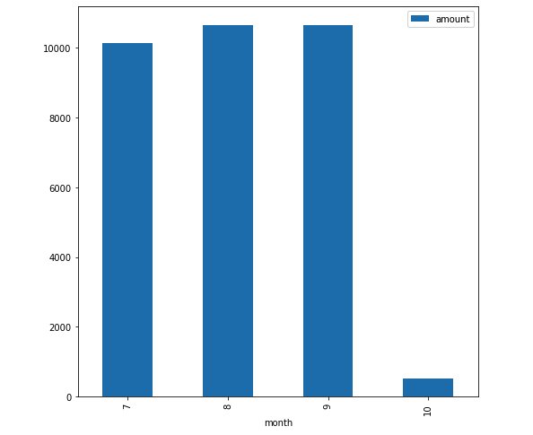

# API Homework

#### Budget Analysis

1. For the income analysis

    * Last Year's Income Before Tax : 7285

    * Current Monthly Income: 500

    * Projected Year's Income Before Tax: 7389

2. expenses per category

    * Food and drink : 3317.19
    * Payment: 6310.50
    * Recreation: 235.50
    * Shops: 1500.00
    * Transfer: 20537.34
    * Travel: 35.19

3. The analysis generated the following plots: 

    * Spending Categories Pie Chart
    
    * Spending per Month Bar Chart
    

#### Retirement Planner

1. based on the monte carlo simulation, the expected cumulative returns at the end of 30 years for the 10th, 50th, and 90th percentiles are: 
    * 10th: 5.49%
    * 50th: 6.77%
    * 90th: 8.22

2. Given the initial investment of $20,000, the expected return for the 10th, 50th, and 90th percentils are $109,867, $135,361, and $164,382, respectively. 

3. Given the projected annul income, a 4% withdrawal rate is less than current annual income and is thus not sufficient. 

4. Given 50% increase in initial investmnet, retirement income is still not sufficient compare to current annual income. 

